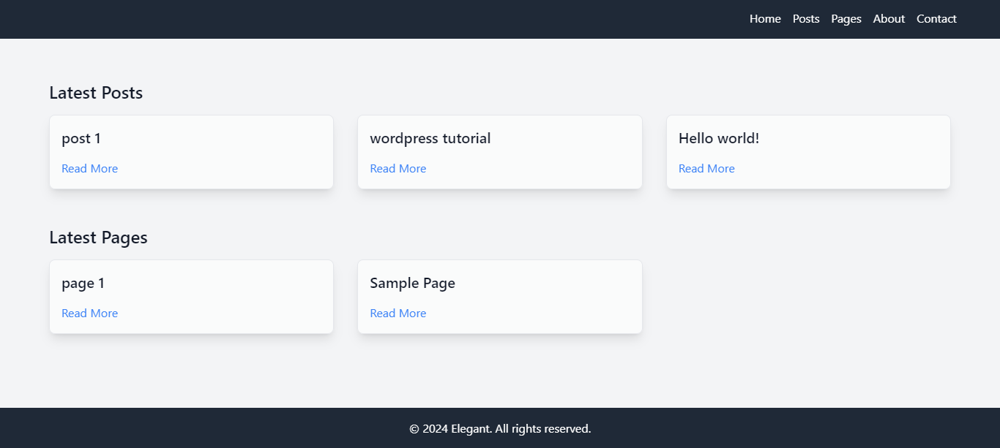
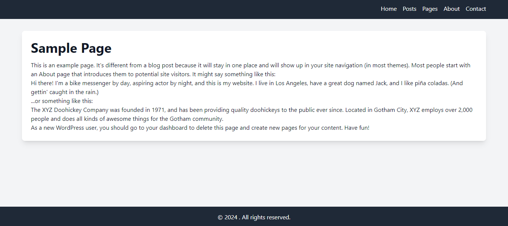

# Aletsch

**Aletsch** is a default WordPress theme created using ElegantGlacier with a clean MVC architecture. Aletsch offers ElegantGlacier's routing system, controllers similar to that of Laravel, twig template engine and TailwindCSS as a rich utility-first CSS framework to streamline a cleaner WordPress development with the aid of ElegantGlacier.

---

## Features

Some key features of Aletsch:

- **Router:** 
WordPress routing is a mess; but with the help of Elegant and Aletsch, a clean and observable routing system is achieved.
- **Controller:**
Take control of every action that needs to be taken for every route and connect them to desired views. 
- **Twig Template Engine:**
No need to mix up php codes and WordPress functions with HTML codes. pass appropriate context to html pages in a structured manner. 


---

## Screenshots

### Landing


*Overview of the Aletsch landing*

### Single Page

 
*Aletsch Single Page or Post*

---

## Installation

To set up Aletsch on your local environment:

1. **Navigate to Wordpress themes directory**

2. **Clone the repository**:
   ```bash
   git clone https://github.com/ElegantGlacier/Aletsch.git

3. **Navigate to Aletsch directory**

4. **Run the following command to require ElegantGlacier using Composer:**:
   ```bash
   composer require elegant-glacier/elegant-glacier

Done. Now you can start developing your own templates and ui or just use the default one.

---

**Contributing**

We welcome contributions from the community! To get started:

1. **Fork the repository**

2. **Create a branch:**
    ```bash
    git checkout -b feature/your-feature

3. **Commit your changes and push:**
    ```bash
    git commit -m "Added new feature"
    
    git push origin feature/your-feature

4. **Create a pull request: Describe your changes and open a PR**